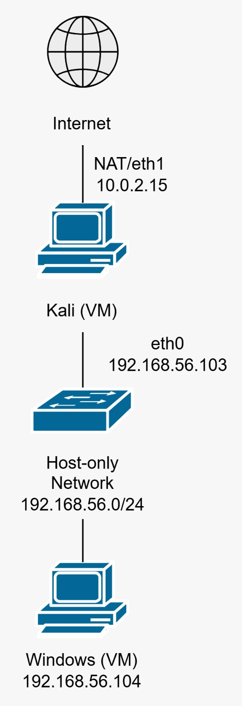

# Basic Network Lab — Kali ↔ Windows

A small VirtualBox networking lab built to understand how
communication works from Layer 2 to Layer 3.

## Objective

- Understand VirtualBox Host-Only networking
- Configure Kali and Windows on the same subnet
- Understand ARP resolution
- Analyze ICMP traffic
- Troubleshoot connectivity using network evidence
- Observe Ethernet, IPv4, and ICMP using tcpdump

## Lab Topology


## Lab Environment

| Component | Role | Network |
|---|---|---|
| Kali Linux | Analysis / testing machine | Host-Only + NAT |
| Windows 11 | Target / endpoint | Host-Only |
| VirtualBox | Virtualization platform | Host-Only Network |

## Network

```text
Host-Only Network
192.168.56.0/24

        ┌──────────────────────┐
        │   VirtualBox         │
        │   Host-Only Network  │
        └──────────┬───────────┘
                   │
          ┌────────┴────────┐
          │                 │
       Kali Linux        Windows 11
     192.168.56.103    192.168.56.104
```
### 1. VirtualBox Network Configuration
The Kali VM uses a Host-Only Adapter for communication with the Windows VM.
The Host-Only network provides an isolated virtual network where the VMs can communicate with each other and the host without directly becoming part of the physical LAN.

### 2. IP Configuration
#### Kali Linux
The network interfaces were checked using:
```text
ip addr
```
Kali uses two interfaces:
```text
eth0 → 192.168.56.103/24
eth1 → 10.0.3.15/24
```
The Host-Only interface (eth0) is used for communication with Windows.

#### Windows
Windows receives an address from the Host-Only network:
```text
192.168.56.104
```
Both machines are therefore located in:
```text
192.168.56.0/24
```

### 3. Initial Connectivity Test
The first connectivity test was performed from Kali:
```text
ping -c 4 192.168.56.104
```
Initially, the ping failed.
At this point, instead of assuming that the network configuration was broken, the next step was to investigate each layer separately.

### 4. Checking ARP / Neighbor Discovery
Kali's neighbor table was checked using:
```text
ip neigh
```
After communication with Windows, Kali learned the MAC address associated with:
```text
192.168.56.104
```
This provided evidence that Layer 2 communication was functioning.

The troubleshooting process therefore became:
```text
    IP configuration
            ↓
      ARP resolution
            ↓
    ICMP connectivity
            ↓
        Firewall
```

### 5. Troubleshooting the Failed Ping
The important observation was that Windows could ping Kali, while Kali could not initially ping Windows.

This suggested that the problem was not simply a broken Host-Only network.

The Windows Firewall was then investigated.

Rather than disabling the firewall completely, a specific inbound ICMP rule was created for the lab:
```text
New-NetFirewallRule `
    -DisplayName "Lab - Allow ICMPv4 Echo" `
    -Protocol ICMPv4 `
    -IcmpType 8 `
    -Direction Inbound `
    -Action Allow
```
This allows ICMPv4 Echo Request packets while keeping the Windows Firewall enabled.

### 6. Successful Connectivity
After allowing inbound ICMP Echo Requests, Kali was able to successfully ping Windows:
```text
ping -c 4 192.168.56.104
```
The result showed successful ICMP Echo Replies with no packet loss.
This confirmed that the underlying network connectivity was working and that the previous failure was related to firewall filtering.

### 7. Packet-Level Analysis
To understand what actually happens during a ping, traffic was captured using:
```text
sudo tcpdump -i eth0 -n -e arp or icmp
```
Then:
```text
ping -c 4 192.168.56.104
```
The capture showed the following sequence:
```text
ARP Request
     ↓
ARP Reply
     ↓
ICMP Echo Request
     ↓
ICMP Echo Reply
```
#### ARP Request
Kali first asks:
```text
Who has 192.168.56.104?
```
The request is sent as an Ethernet broadcast:
```text
ff:ff:ff:ff:ff:ff
```
Windows then responds with its MAC address.

#### ARP Reply
Windows replies:
```text
192.168.56.104 is-at <Windows MAC>
```
Kali can now associate the destination IP with the destination MAC address.

#### ICMP Echo Request
After ARP resolution:
```text
192.168.56.103 → 192.168.56.104
ICMP Echo Request
```
#### ICMP Echo Reply
Windows responds:
```text
192.168.56.104 → 192.168.56.103
ICMP Echo Reply
```
### 8. Understanding Layer 2 and Layer 3
The packet capture helped connect the concepts together.
#### Ethernet — Layer 2
```text
Source MAC → Destination MAC
```
Example:
```text
08:00:27:5a:87:bc
        ↓
08:00:27:fe:c0:d8
```
#### IPv4 — Layer 3
```text
192.168.56.103 → 192.168.56.104 
```
#### ICMP
```text
Echo Request
      ↓
Echo Reply
```
The resulting mental model is:
```text
Ethernet
   │
   └── IPv4
         │
         └── ICMP
              ├── Echo Request
              └── Echo Reply
```
This was one of the main concepts I wanted to understand through the lab.

### 9. Troubleshooting Process
The troubleshooting process can be summarized as:
```text
Kali has incorrect / old IP configuration
              ↓
       Configure DHCP
              ↓
    Kali → 192.168.56.103
              ↓
    Windows → 192.168.56.104
              ↓
        Check ARP
              ↓
     ARP resolution works
              ↓
         Ping fails
              ↓
     Check firewall behavior
              ↓
    Allow inbound ICMP Echo
              ↓
         Ping succeeds
              ↓
       Capture traffic
              ↓
      ARP → IPv4 → ICMP
```

### 10. Tools Used
- VirtualBox
- Kali Linux
- Windows 11
- ip addr
- ip route
- ip neigh
- ping
- tcpdump
- Windows PowerShell
- Windows Firewall

## What I Learned
The main lesson from this lab was that "ping failed" does not immediately mean that the network is broken.

By checking the network step by step, I could separate:
- IP configuration
- Layer 2 connectivity
- ARP resolution
- Layer 3 connectivity
- ICMP
- Firewall filtering
The most useful mental model from this lab is:
```text
Host
 ↓
Interface
 ↓
IP configuration
 ↓
ARP
 ↓
Ethernet Frame
 ↓
IPv4
 ↓
ICMP
 ↓
Firewall
```
Instead of simply learning commands, I want to understand why the network behaves the way it does.

## Next Step
This lab is the first step of my cybersecurity homelab roadmap.
Next:
```text
Basic Networking
       ↓
Multi-VM Network
       ↓
Subnetting / Routing / VLAN
       ↓
Wireshark / Suricata / Nmap
       ↓
Endpoint Security
       ↓
Active Directory
       ↓
Cloud Networking
       ↓
Cloud Security
       ↓
DevSecOps
```

## Status
Completed
- VirtualBox Host-Only Network
- Kali ↔ Windows connectivity
- DHCP configuration
- IP addressing
- ARP / neighbor discovery
- ICMP
- Basic firewall troubleshooting
- Packet capture with tcpdump
- Layer 2 / Layer 3 analysis
